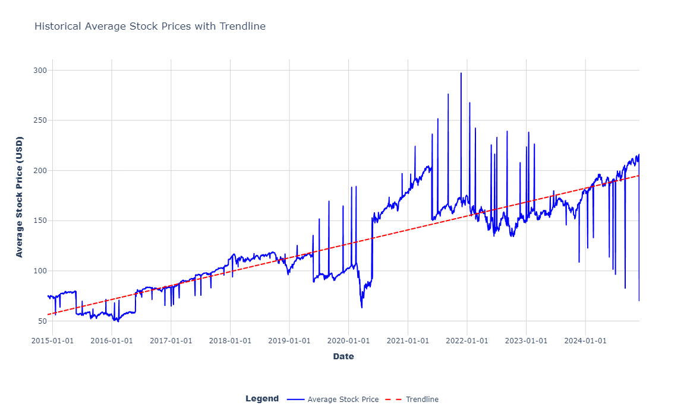
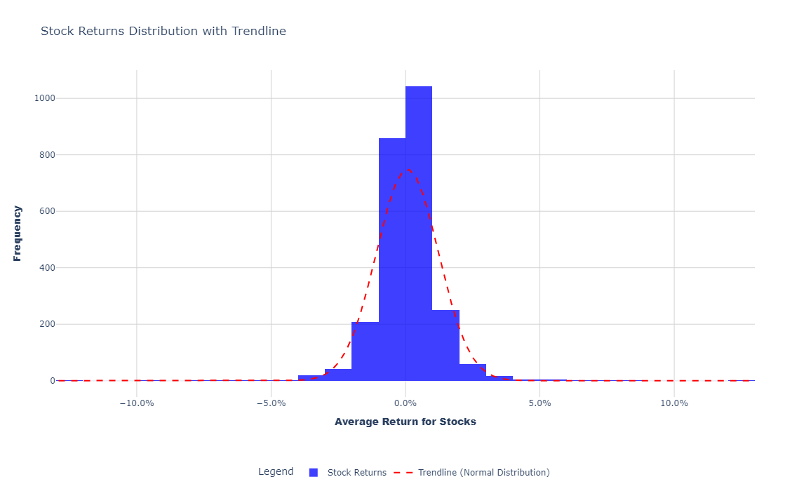
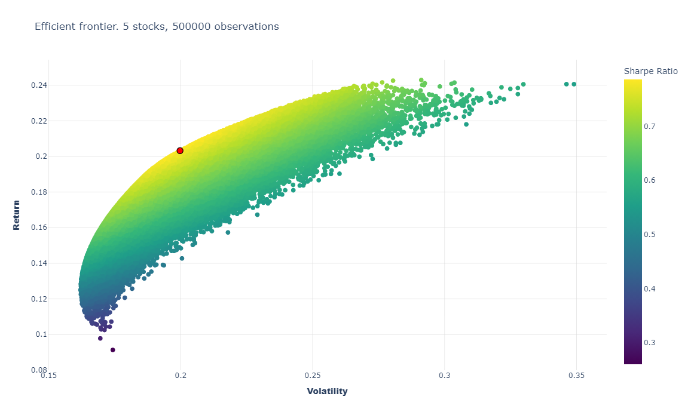
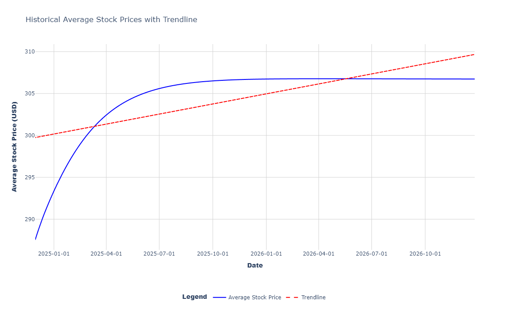
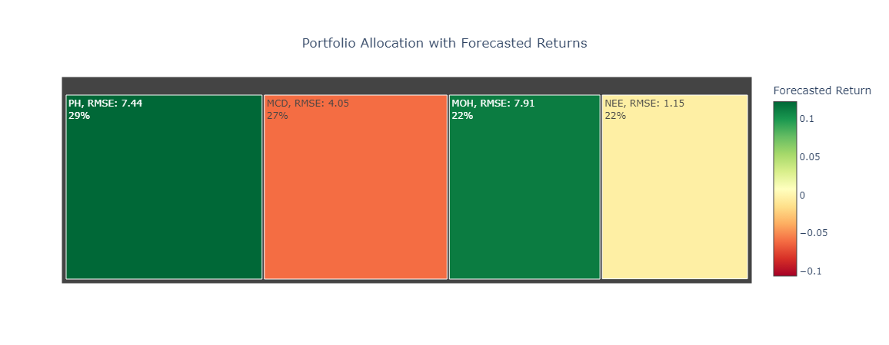
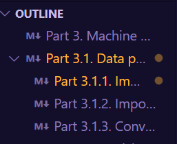

# Portfolio Optimiation in Python using Machine Learning
The following project is devoted to portfolio optimization with the usage of Python tools, particularly the Machine Learning tools.
Here is what you can come up with:

<div align="center">
    
    
    
    
    
    
</div>


## Table of Contents
- [Introduction](#introduction)
- [Installation](#installation)
- [Usage](#usage)
- [Contributing](#contributing)
- [License](#license)
- [Acknowledgments](#acknowledgments)

## Introduction
This project was initially the part of my course project for Business Analytics. As more I've learned, the more I added into the project, and the more confidence I gained making this repo publicly available. 
The code designed in the way so you would either like to follow it as it is, or rewrite it for your own analytical purposes. 
You would consider this project valuable because it, from the one hand, uses modern portfolio analytical tools to make some assumptions based on historical data, and from the other hand suggests you to look at the data that is forecasted and to compare both kinds of conclusions and so on to catch more valuable analytical insights.

## Installation
1. Clone the repository:
```bash
git clone https://github.com/prudnik-web/portfolio_optimization_ml.git
```
2. Go to the project directory:
```bash
cd portfolio_optimization_ml
```

3. Create and activate virtual environment:
```bash
python -m venv .venv
.\.venv\Scripts\activate
```

4. Install dependencies:
```bash
pip install -r requirements.txt
```
>[!info] You may also have to specify the interpreter for .ipynb manually (that should be done with all of the files) - choose the one you've created.

## Usage
> [!WARNING] The project is designed in a way you launch part1-part4 notebooks sequentially at least the first time. I recommend to get to the project logic first of all.
1. You should go to _src_ folder and open __part1_data_scraper.ipynb__ and click _Run All_. Then you should wait a bit till the code is executed.
2. Open __part2_main_analysis.ipynb__ and click _Run All_. You will be prompted with the number of stocks you would like to select for the analysis (I recommend to choose no more than 50 - be realistic with the values).
3. Do same with __part3__.
4. Open __part4__ and __DON'T CLICK__ _Run All_. Follow the instructions included in the file itself.
5. As the result, you will have a collection of visuals, the same as in the beginning of the page.

> [!tip] You would like to navigate the .ipynb files using outline (check if this feature is available in your IDE):


## Contributing
I would really appreciate if you would like to put some efforts into the development of this project. 

### Ways to Contribute
1. **Report Bugs**: Found a bug? [Open an issue](https://github.com/prudnik-web/portfolio_optimization_ml/issues) with detailed steps to reproduce it.
2. **Suggest Features**: Have an idea for a new feature? Share it in the [Discussions](https://github.com/prudnik-web/portfolio_optimization_ml/discussions) or as an issue.
3. **Fix Issues**: Browse open issues and fix one! We label beginner-friendly issues with `good first issue`.

### How to Contribute Code
1. **Fork the Repository**: Click the "Fork" button at the top of this page.
2. **Clone Fork**:
   ```bash
   git clone https://github.com/prudnik-web/portfolio_optimization_ml.git
   cd portfolio_optimization_ml

3. **Create a branch**:
    ```bash
    git checkout -b feature/feature-name

4. **Make changes**: Ensure your code adheres to the style and guidelines of the project

5. **Test**: Personally, I've never written a single test, but... We should anyway test what we do with the code and ensure the things work in a proper way - you can do it as you wish, either by spending some time on review or by writing test, but anyway - **test, test and test!**

6. **Commit and Push**:
    ```bash
    git add .
    git commit -m "Commit message"
    git pust origin feature/feature-name

7. **Submit a Pull Request**:
    - Go to the original repo
    - Click *Pull Request* and then *New Pull Request*
    - Choose the branch and describe what changes do you propose

## License
This project is licensed under the MIT License. See the [LICENSE](LICENSE) file for details.

## Acknowledgments 
I would like to express my heartfelt thanks to all the people who support me — my parents, my brother, my girlfriend, and my friends. I wouldn't be who I am without your care and support. Thank you.